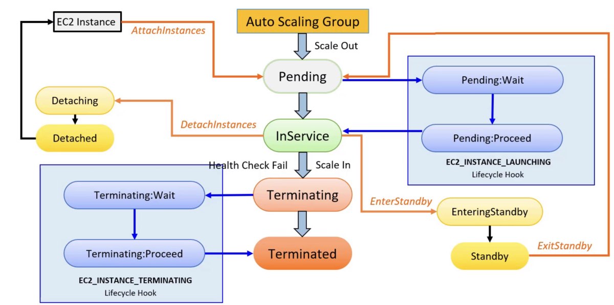
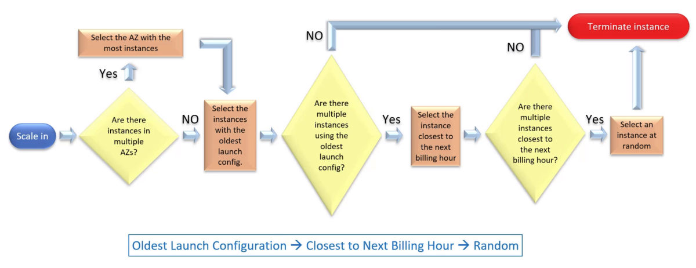

# AWS ELB - Elastic Load Balancer

A load balancer accepts the traffic to your application and distributes it to the registered targets (EC2 instances, containers and IP addresses) such that none of them gets overloaded, reuccing the posibilities of a bottleneck. (_Elastic_ means that the load balancer automatically scales).

Handles the application layer traffic (HTTP) and network layer traffic (TCP).

AWS ELB monitors the health of its registered targets and ensures that it routes the traffic only to **healthy targets**.

With an ELB you can add of remove resources from your balancer without disrupting the service.

It can be managed from AWS Management Console, CLI, SDK or Query API.

Hybrid Load Balancing: it balances across AWS and on-premises resources.

### Types

- Application Load Balancer.
- Network Load Balancer.
- Classic Load Balancer.

### Differences between ALB and NLB

| Parameter                        | ALB            | NBL                 |
| -------------------------------- | -------------- | ------------------- |
| OSI layer operation              | Layer 7 (HTTP) | Layer 4 (TCP)       |
| Cross-Zone LB                    | Always enabled | Disabled by default |
| SSL Offloading support           | Yes            | No                  |
| Client request terminates at LB? | Yes            | No                  |
| Headers modified?                | Yes            | No                  |
| Host based routing               | Yes            | No                  |
| Path based routing               | Yes            | No                  |
| Static IP address for LB support | No             | Yes                 |

### Main components

- **Listeners**:
    - Process that checks for connection requests, using the given protocol and port.
    - Each listener has a default rule, and more can be added. Default rule cannot have conditions and cannot be removed.
    - You need to configure SSL server certificate on ALB if the listener is configured for HTTPS.
    - Provide native support for WebSockets (HTTP and HTTPS) and HTTP/2 with HTTPS listeners.
- **Rules**:
    - Determines where the traffic will be forwarded.
    - Support HTTP and HTTPS and ports 1-65535.
    - They have priority (1, 2... the lower the higher), one or more actions, an optional host condition, and an optional path condition.
    - Conditions can be host conditions or path conditions
    - There is also a provision for a fixed-response action.
- **Health Checks**.
    - Monitors the health of the registered targets.
    - Health checks are performed on all targets registered in a target group that is specified in a listener rule.
- **Targets and Target Groups**.
    - Target groups are used to route requests to one or more registered targets.
    - You can configure different target groups for different types of requests.
    - Each Target Group has its own health checks.
    - Attaching a target group to an auto scaling group enables you to scale each service dynamically based on demand.
    - _Slow start mode_ gives targets time to warn up before the load balancer send them a full share of requests.

### How it selects the target:
1. Evaluates the **listener** rules in **priority order** to determine which rule to apply.
2. Monitors the health of the registered targets.
3. Selects a healthy target from the target group.

### Security policy notes:
- SSL Offload: You can deploy SSL certificate on the ALB itself.
- Security policy: Combination of protocols and ciphers to negotiate SSL connections between the client and the load balancer.
- SSL Renegotiation is not supported
- SSL Certificate: X.509 certificate (SSL/TLS server certificate)

### Important notes:
- When you enable an Availability Zone (AZ) for your load balancer, ELB creates a load balancer node in the AZ. If you register targets in your AZ but do not enable the AZ, these targets **do not receive traffic**.
- Cross-Zone Load Balancing: it routes the traffic to its registered targets in one or more AZ. It's enabled by default for Application Load Balancer and disabled by default for Network Load Balancer.
- The most effective way of using a load balancer is to ensure that it encompasses multiple AZ and each AZ has as least one registered target.
- If you disable a AZ, the targets in that AZ remains registered with the load balancer, but it will not route traffic to them.
- Listeners: You configure your load balancer to accept incoming traffic by specifying one or more listeners.

## ALB - Application Load Balancer

Accepts the HTTP/HTTPS traffic from clients.

#### Main characteristics:
- High availability.
- Internet-facing or Internal.
- Health checks.
- Supports SSL.
- Cross-Zone Load Balancing is always enabled.

## NLB - Network Load Balancer

Accepts the TCP traffic from clients.

#### Main characteristics:
- It selects the target using a _flow hash algorithm_, based on the protocol, source IP and port, destination IP and port and TCP sequence number.
- It has the ability of handle volatile workloads and scale to millions of requests per second.
- Cross-Zone Load Balancing is disabled by default.

## Autoscaling

**Scaling**: Increase or decrease the compute capacity based on certains conditions.

**Autoscaling**: AWS service that automates the scaling of AWS resources (EC2, etc).

#### Benefits:
- High availability: Mantains computed capacity for optimun performance.
- Fault tolerance: Replaces unhealthy instances.
- Cost saving: Adjust compute capacity to support unpredicted circunstances.
- High performance: Quickly scales up to meet requirements.
- Flexibility: Support scaling based on different criteria.
- Its free.

### Components

- **Launch configuration**.
    - Template indicating "what to launch".
    - Contains information for the instances.
        - Amazon machine Image (AMI) ID.
        - Instance type.
        - Key pair.
        - Security groups.
        - Block device mapping.
    - Cannot be modified once created.
    - Can be created using the attributes from a running EC2 instance.
    - _Launch templates_ can be created from existing configurations.
    - One launch configuration can be used by multiple ASG.
    - If your Autoscaling needs instances with different configuration, create a new one and associate it with the ASG.
- **Auto Scaling Group (ASG)**.
    - Logical grouping of the instances for the purposes of instance scaling and management.
    - Scales the number of instances automatically based on the specified criteria (or mantain the number of working instances even if one becomes unhealthy).
    - Can only have one launch configuration at a time.
    - Performs periodic Health Checks on the instances of the group. If an instance becomes unhealthy, the group terminates it and launches a new healthy one. 
    - It specifies minimun, desired and maximun capacity.
    - When an ASG is deleted, its minimun, desired and maximun capacity are set to 0, so the Autoscaling instances are terminated (you can detach any instance before delete de ASG).
- **Scaling Options**.
    - Scaling policies are used to increase or decrease the number of running EC2 instances in your ASG.
    - An ASG can have more than one scaling policy.
    - Ways to scale your ASG:
        - Mantain current instance levels at all times.
        - Manual scaling.
        - Scale based on a schedule.
        - Scale based on demand.

### How it works

1. Create a launch configuration.
    - Select AMI.
    - Add customization via User Data.
    - Add storage.
    - Apply security group.
2. Create and Auto Scaling Group.
    - Define group size.
    - Setup network and subnet.
    - Attach a load balancer (optional).
    - Add scaling policies.
    - Add notification (optional).

### Lyfecycle

#### Cycles:

- (Start) -> Pending -> In service -> (Fails) -> Terminating -> Terminated
- (Detach) -> Detaching -> Detached -> (Attach) -> Pending -> In service
- (Standby) -> EnteringStandby -> Standby -> (Exit Standby) -> Pending -> In service

#### Hooks:

- Pending:Wait -> After enter Pending
- Pending:Proceed -> Before enter In service
- Terminating:Wait -> After enter Terminating
- Terminating:Proceed -> Before enter Terminated

### Instance Termination Logic

## Monitoring

#### Types
- Request tracing.
- Access logs.
    - [S3](S3.md) bucket must be located on the same region and have policy that grants ELB permissions to write.
- [CloudWatch](CloudWatch.md) metrics.
    - Only when requests are flowing through the LB.
    - 60-seconds periods.
- [CloudTrail](CloudTrail.md) logs.
    - Logs only API calls, not HTTP requests made to LBs.