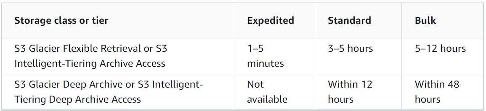

# AWS S3 - Simple Storage Service

AWS Object Storage Service.

#### Main features:

- Durability, avalavility, scalability, reliability, fast, inexpensive, secure, easy
- Object based (it can't edit one chunk of the file, it treats the file as a whole)
- Provides a Rest and a SOAP (deprecated) interfaces

### Definitions:

- **Objects**: Entities stored in S3 (image, audio, files...). Consist in objects data and metadata. The object created in a region never leaves that region (unless you transfer it, and it can be replicated via Cross-Region Replication (CRR)).
- **Bucket**: A container that stores objects. (Bucket have regions but can be globally accessed).
- **Endpoint**: URL entry point for a web service. (Most AWS offer a regional entry point).
- **Key**: Objects unique identifier. The combination of bucket, key and optional version identifies an object in S3.

## ARN

The following common Amazon Resource Name ([ARN](ARN.md)) format identifies resources in AWS:

```
arn:{partition}:s3:{region}:{namespace}:{relative-id}
```

The following ARN identifies the `/dev/info.doc` object in the `lorem` bucket:

```
arn:aws:s3:::lorem/dev/info.doc
```

## Access point

arn:aws:s3:[region]:[account]:accesspoint/[access-point-name]/object/[prefix]/*

Examples:
 - `arn:aws:s3:us-east-2:123456789012:accesspoint/test/object/unit-05/hr/*` represents all objects under prefix **unit-05/hr** for access point name **test** belonging to account **123456789012** in **us-east-2** region.

## Data consistency model

#### Definitions:

- **Read after Write Consistent**: "Consistent".
- **Eventually Read after Write Consistent**: S3 will provide the final data when the object is finally created.
- **Eventually Consistent**: S3 may take some time to provide the final data.

#### How S3 handles data consistency:

- **New object**: "Read after Write Consistent".
- **Read while creating**: "Eventually Read after Write Consistent". 
- **Update object**: S3 is "Eventually Consistent".
- **Delete object**: S3 is "Eventually Consistent".

## Versioning

Allows to mantain multiple versions of an object in the same bucket.

Deleteion can be MFA required.

### States:

- Un-versioned (default). Objects has null version ID.
- Versioning-enabled. Deleted objects have a "Deleted mark".
- Versioning-suspended.

## Encryption

Can be server-side (SSE) or client-side (CSE). Server-side uses AES-256.

### SSE types:

- **SSE-S3**: AWS S3 Managed Keys (SSE-S3).
- **SSE-KMS**: AWS Key Management Service ([KMS](KMS.md)) Managed Keys (SSE-KMS). Allows to have separated permissions for the use of the envelope key and audit it use.
- **SSE-C**: Custom Provided Keys. Encryption keys are managed by the customer.

### CSE types:

- **AWS-KMS-managed key**.
- **Client-side Master Key**.

## Tags, Transfer Acceleration, and Multipart Upload

- A **Tag** is a key-value label to the AWS resources (organization, automatization, access control, cost audit, etc).
- **S3 Transfer Acceleration** enables file transfers over long distances.
- **Multipart Upload** enables upload of large objects (>100MB) in parts.

### When to use Transfer Acceleration?

- Customers needs to upload files worldwide to a centralized bucket.
- Transfer large amounts of data across continents on a regular basis.
- You underutilize the available bandwidth when uploading to S3

## Events

Send notifications when some event occurs in your bucket.

Event can be sent over:
    - **SNS Topic** (email, sms, http...)
    - **SQS Queue**
    - run code via **Lambda Functions**.

## Bucket Policy & ACL

- **Access Control List** enables to manage access on buckets and objects. (Permissions: READ, WRITE, READ_ACP, WRITE_ACP, FULL_CONTROL).
- **Bucket Policy** grants other AWS accounts or [IAM users](IAM.md#users) access permissions for the bucket. Used to manage cross-account permissions for al S3 permissions.

Both Bucket Policy & Access Control List are resource-based policies.

### Access Analyzer

Access Analyzer can be enabled to get a list of all Amazon S3 buckets with public access. It can help to gather the following information:

- Bucket name
- Discovered by Access analyzer
- Shared through
- Status
- Access Level

## Object Lifecycle Management

Manages the storage of objects and it associated costs. Is used to manage the storage classes of the object depending upon it usage (Transition) or its expiration time (Expiration)

## Cross-Region Replication (CRR)

Automatic asynchronous copy of objects between regions.

Multiple rules can be added based upon the subset of objects to be matched. Filter for these rules can be based upon:
- Objects tag.
- Object key prefixes.
- Any combination of both.

#### Notes:
- Replicates objects, metadata and tags.
- Both source and destination bucks must have versioning enabled.
- S3 must have permissions to replicate objects from the oringin to the destination bucket on your behalf (rule must be created). For cross-account scenario, create a [IAM Role](IAM.md#roles).
- Only applies to new objects since the replication config is set.
- It works with SSE-S3 or SSE-KMS encryption.
- S3 only replicates objects in the source for which the bucket owner has permissions to read objects and Access Control List.
- It not replicate replicas.
- For delete without versioning, S3 adds a delete marker and replicates to the destination.
- For delete with versioning, S3 deletes the objects version but does not replicate the deletion in the destination.

## Storage classes

- **S3 Standard**
    - General purpose.
    - Data is replicated across (at least) 3 availability zones (AZ).
    - Highest durability (99.99999999%) (99.99999999%) and availability (99.99%)
    - Low latency and high throughput.
    - Minimun capacity charge per object and time: N/A and N/A
    - Retrieval fee: N/A
    - Support Life Cycle Policies.
- **S3 Intelligent-Tiering**
    - Cost optimization without performance impact.
    - Moves objects no accessed during the last 30 days to IA.
    - Data is replicated across (at least) 3 availability zones (AZ).
    - Highest durability (99.99999999%), high availability (99.9%)
    - Minimun capacity charge per object and time: N/A and 30 days
    - Retrieval fee: N/A
    - Lower cost than S3 Standard but charges a monthly monitoring and automation fee.
    - Support Life Cycle Policies.
- **S3 Standard-IA (Standard Infrecuent Access)**
    - Long-lived but less frequantly access.
    - Highest durability (99.99999999%), high availability (99.9%)
    - Data is replicated across (at least) 3 availability zones (AZ).
    - Minimun capacity charge per object and time: 128KB and 30 days
    - Retrieval fee: Per GB
    - Lower cost than S3 Standard.
    - Support Life Cycle Policies.
- **S3 One Zone-IA**
    - Long-lived but less frequantly access. Good options for secondary backups.
    - Data is stored only in one availability zone (AZ).
    - Highest durability (99.99999999%), medium availability (99.5%)
    - Minimun capacity charge per object and time: 128KB and 30 days
    - Retrieval fee: Per GB
    - Cost 20% less than Standard-IA.
    - Support Life Cycle Policies.
- **S3 Glacier**
    - Long-term low-cost storage.
    - Highest durability (99.99999999%)
    - Three options for retrieving archives: Standard, Expedited and Bulk.
    - Data is replicated across (at least) 3 availability zones (AZ).
    - Minimun capacity charge per object and time: 40KB and 90 days
    - Retrieval fee: Per GB
    - Retrieving data can last minutes to hours.
- **S3 Glacier Deep Archive**
    - Long-term low-cost storage.
    - Highest durability (99.99999999%)
    - Data is replicated across (at least) 3 availability zones (AZ).
    - Data can be retrieved within 12 hours.
    - Minimun capacity charge per object and time: 40KB and 180 days
    - Retrieval fee: Per GB
    - Lowest cost.

## Static Website Hosting

In bucket properties we can set a bucket as an html static page iwth and index and an error html page

## Server access logging && Object level logging

### Server access logging

- Provides records for the buckets requests.
- Disabled by default.
- Source and target bucket should be in the same region.
- S3 Log Delivery must have permission to write on the target bucket.
- Delivered on a "Best Effort Basis" (most within a few hours)

### Object level logging

- Provides records for the objects requests.
- It's enabled on bucket level.
- Requires CloudTrail service setup.
- Leverages CloudTrail service offerings.

### Fields

Access Logs can be used to record the following fields:

- Bucket Owner
- Bucket
- Time
- Remote IP
- Requestor
- Request ID
- Operation
- Key
- Request-URI
- TTP Status
- Error Code
- Bytes Sent
- Object Size
- Total Time
- Turn-Around Time
- Referer
- User-Agent
- Version Id
- Host Id
- Signature Version
- Cipher Suite
- Authentication Type
- Host Header
- TLS version


## Select from objects using Queries

Extract records from an stored CSV or JSON file using SQL expressions. Also supports GZIP compressed files.

## Object lock

Object locks apply to a specific version of an object in a versioned bucket.

## Object retrieval

Standard or Bulk retrieval options can be used with the S3 Glacier Deep Archive storage class. An expedited retrieval option can be used with the S3 Glacier storage class to restore data. Also, restoration can be changed for the S3 Glacier storage class while restoration is in progress. The typical time frame for data retrieval is as follows.

### Typical time for data retreival



## Inventories

Multiple Inventory lists can be created for a bucket with inventory files saved in encrypted format.

## Batch Operations

For creating Job request, the following parameters need to be specified:

- Operation
- Manifest
- Priority
- RoleArn
- Report
- Tags
- Description

Out of these parameters, Tags & Description are optional & the rest should be specified while creating Job.