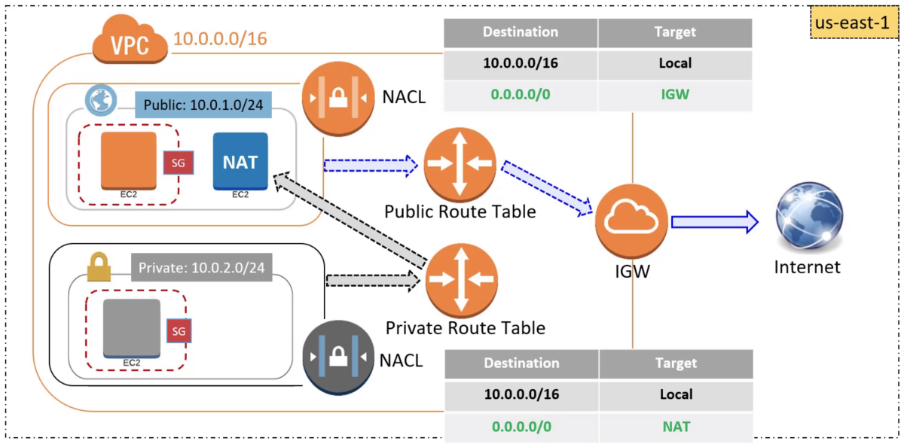

# AWS VPC - Virtual Private Cloud

Private network to create resources in it, logically separated from other VPCs.

## Main concepts

- **Region**:
    - A VPC belongs to a single region, but multiple VPC can exists on a single region.
    - A VPC can span multiple AZ.
- **CIDR (Classless Inter-Domain Routing)**:
    - A method for  allocating IP addresses and IP routing.
    - When creating a VPC, a range of IPv4 has to be specified in the form of a CIDR block (ex 10.0.0.0/16 -> primary CIDR block for the VPC).
    - CIDR notation is a compact representation of an IP address and its associated routing prefix (ex 10.0.0.0/24 represents the IP 10.0.0.0, its subnet mask 255.255.255.0 which has 24 leading 1-bits, and its routing prefix -> `2 ^ (32 - 24) = 256` addresses available).
- **Subnet**:
    - A part of the VPC that also has CIDR blocks
    - A subnet can only be inside a single AZ.
    - You need to create one or more subnets inside your VPC to be able to launch the resources.
    - Typically you will create a _private subnet_ (not exposed to internet or outside the VPC) and a _public subnet_ (exposed to internet).
    - The subnets inside a VPC cannot have overlapping IP address ranges
- **NAT Instance (Network address Translation)**:
    - Mechanism that contains a physical device acting as a mediador between the instances inside the network and the internet.
    - It is just an EC2 instance with NAT capability which stays in a public subnet.
    - When an instance inside the network request someting from internet, the NAT device keeps track of the private IP address of the instance, and makes the request with its own public IP, hidding the instance address. When the requested site replies, the NAT check what instance has done the request, and returns the information to it. This way the private IP address of the instance is never exposed to the internet.
- **NAT Gateway**:
    - AWS managed NAT device.
    - Highly available and scalable.
    - Works on the subnet level.
- **Internet gateway (IGW**:
    - A horizontally scaled, redundant and highly available VPC component that allows communication between instances in your VPC and the internet.
    - Purposes:
        - Provides a target in your VPC route tables for internet-routable traffic.
        - Performs network address translations (NAT) for instances that have been assigned public IPv4 addresses.
    - Works on the VPC level.
- **Route table**:
    - Contains a set of rules (routes) used to determine where the traffic is directed.
    - Each route in a table specifies a destination CIDR and a target.
    - Each subnet must be associated with a route table, which controls the routing for the subnet. If you don't explicity associate a subnet with a route talbe, the subnet is implicity associated with the main route table.
    - You cannot delete a main route table, but they can be replaced.
    - Every route table contains a local route for communication within the VPC over IPv4.
    - When you add an Internet Gateway an egress-only Internet Gateway, a Virtual Private Gateway, a NAT device, a peering Connection or a VPC endpoint in your VPC, you must update the route table for any subnet that uses these gateways or connections.
- **Security Groups**:
    - A set of "firewall" rules that control the traffic for your instance.
    - They define which port and protocols are allowed for incoming and outgoing traffic for the instance
    - Works at instance level, so they are the first layer of defence for an instance.
    - Stateful: if a port is open for incoming traffic, it is automatically open for outgoing traffic.
- **Network Access Control List (NACL)**:
    - Consist of ordered rules, which contains:
        - Rule number (the lowest, the sooner that the rule is evaluated).
        - Protocol (80 for HTTP, 443 for HTTPS...).
        - Traffic source (CIDR range) and destination port or port range (listening) [for inbound rules].
        - Traffic destination (CIDR range) and destination port or port range [for outbound rules].
        - Action (ALLOW or DENY).
    - Works at the subnet level. -> Second layer of defence.
    - Stateless: if a port is open for incoming traffic, it is not automatically open for outgoing traffic.

### NAT Instance vs NAT Gateway

| NAT Instance | NAT Gateway |
| --- | --- |
| Customizable, User is in control, but multiple instances needed to highly available and scalable. | Managed by AWS and highly available and scalable |
| Can become single point of failure | Least likely to become single point of failure |
| Flexibility in size and type | Uniform offering from AWS |
| Can be used as a Bastian server | Cannot be used as a Bastian server |
| Port forwarding supported | Port forwarding not supported |
| Support reassembly of IP fragmented packets for UDP, TCP and ICMP | Does not support fragmentation for TCP and ICMP (will get dropped) |

### Typical VPC diagram

## VPC Peering

Networking connection between two VPCs that enables you to route traffic between them using private IPv4/IPv6 addresses.

#### Notes:
- Can be used between VPCs owned by different AWS accounts or in different regions.
- There is no single point of failure or bandwidth bottleneck.
- Helps the transfer of data.
- You cannot edit the VPC Peering connection once is created, and you cannot attach or detach VPC Peering connections.
- No transitive: VPC(A) peering with VPC(B) is not peering with other VPC that VPC(B) is peering with.

## VPC Endpoints

Virtual devices that enables you to privately connect your VPC to supported AWS services and VPC endpoint services powered by PrivateLink without requiring an Internet Gateway, NAT device, VPN connection or AWS Direct Connect.

#### Notes:
- Instances in your VPC do not require public IP addresses to comunicate with resources in the service.
- Traffic between your VPC and the other service does not leave the Amazon network.
- Horizontally scaled, redundant, and highly available VPC components.

### VPC Endpoint types:

- **Interface endpoints**: An elastic network interface with a private IP address that serves as an entry point (Eg CloudFormation, AWS CLoudWatch, etc).
- **Gateway endpoints**: Target for a specified route in your route table (Eg S3, DynamoDB, etc).

## VPC Flow Logs

Enable information capturing about the IP traffic going to and from network interfaces in your VPC.

You can retrieve and view the records in the log group, bucket, or other delivery stream.

To create a flow log, you specify:
- The resource for which to create the flow log, like a VPC, a subnet or a network interface ([ELB](ELB.md), [ElastiCache](ElastiCache.md), etc).
- The type of traffic to capture (Accepted, Rejected or all).
- The destinations, like [CloudWatch](CloudWatch.md), [S3](S3.md) or [Kinesis](Kinesis.md) Data Firehose.

#### Notes:
- It's not real-time.
- Doesn't affect network throughput or latency.
- If you create one for a subnet or VPC, each related network interface is monitored.

### Flow log limitations

- You cannot enable flow logs for network interfaces that are in the EC2-Classic platform. 
- You can't enable flow logs for VPCs that are peered with your VPC unless the peer VPC is in your account.
- After you create a flow log, you cannot change its configuration or the record format (so delete it and create one).

### Not captured traffic:

- DHCP traffic.
- Mirrored traffic.
- Traffic to the reserved IP address for the default VPC router.
- Traffic between an endpoint network interface and a Network Load Balancer network interface.

### LAG - Link Aggregation Groups

A link aggregation group (LAG) is a logical interface that uses the Link Aggregation Control Protocol (LACP) to aggregate multiple connections at a single AWS Direct Connect endpoint, allowing you to treat them as a single, managed connection.

You can create a LAG from existing connections, or you can provision new connections.

The following rules apply:
- All connections must be dedicated connections and have a port speed of 1 Gbps, 10 Gbps, or 100 Gbps.
- All connections in the LAG must use the same bandwidth.
- You can have a maximum of two 100G connections, or four connections with a port speed less than 100G in a LAG. Each connection in the LAG counts towards your overall connection limit for the Region.
- All connections in the LAG must terminate at the same AWS Direct Connect endpoint.

